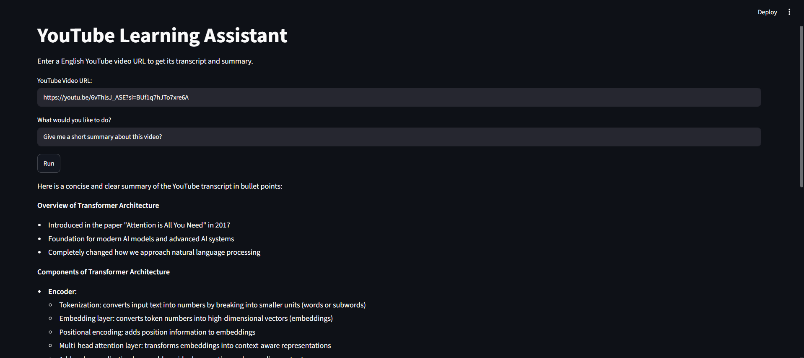
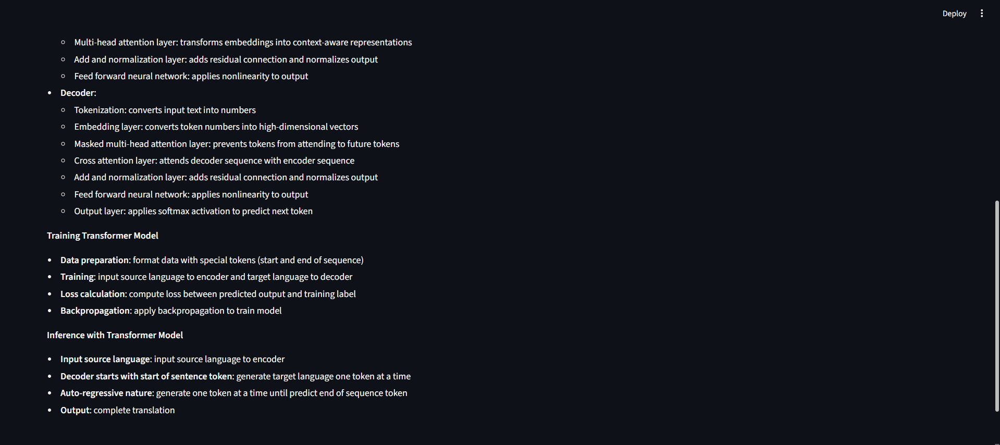
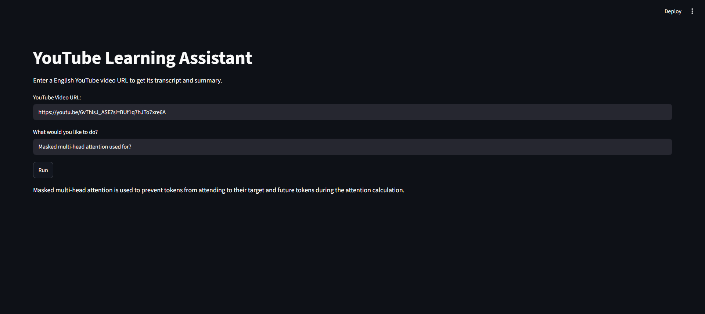

# YouTube Learning Assistant

An AI-powered learning assistant that helps users understand YouTube videos by generating summaries, answering questions, and intelligently routing requests using LangGraph.

This project was built incrementally to understand the fundamentals of **LLMs, RAG, LangChain, LangGraph and MCP**. Instead of relying on high-level abstractions, the focus was on implementing each concept step by step.

---

## 🚀 Features

* 📄 Extract transcripts from YouTube videos
* 📝 Generate concise AI-powered summaries
* 💬 Ask questions about video content
* 🔎 Retrieve relevant transcript chunks using RAG
* 🤖 Route user requests with LangGraph
* 🎯 Clean and modular project structure

---

## 🛠️ Tech Stack

* Python
* Streamlit
* LangChain
* LangGraph
* FAISS
* HuggingFace Embeddings
* Groq API (Llama)
* YouTube Transcript API
* Model Context Protocol

---

# 📚 Project Evolution

The project was developed in three stages, with each version introducing a new concept.

---

## 📌 Version 1 — YouTube Video Summarizer

The first version focuses on generating a concise summary from a YouTube video's transcript.

### Workflow

```text
YouTube URL
      │
      ▼
Get Transcript
      │
      ▼
LLM
      │
      ▼
Summary
```

### Concepts Learned

* Working with LLMs
* Prompt Engineering
* YouTube Transcript Extraction
* Streamlit Basics

---

## 📌 Version 2 — RAG-Based Question Answering

The second version extends the application by allowing users to ask questions about the video. The transcript is converted into embeddings and stored in a FAISS vector database for semantic retrieval.

### Workflow

```text
YouTube URL
      │
      ▼
Transcript
      │
      ▼
Text Splitter
      │
      ▼
Embeddings
      │
      ▼
FAISS Vector Store
      │
      ▼
Similarity Search
      │
      ▼
LLM
      │
      ▼
Answer
```

### Concepts Learned

* Retrieval-Augmented Generation (RAG)
* Text Chunking
* Embeddings
* FAISS Vector Store
* Semantic Search

---

## 📌 Version 3 — LangGraph Integration (Agentic Workflow)

The final version combines summarization and question answering into a single intelligent workflow.

Instead of selecting different buttons for each task, the user simply types a request such as:

* *"Summarize this video."*
* *"What is self-attention?"*

A **Router Node** understands the user's intent and directs the request to the appropriate agent.

### Workflow

```
                 START
                    │
                    ▼
             Router Node
             /         \
            ▼           ▼
    Summary Agent    QA Agent
            │           │
            └─────┬─────┘
                  ▼
                 END
```

### LangGraph Concepts Used

* State Management
* Nodes
* Conditional Routing
* Graph Execution
* Agent Orchestration

---

## 📌 Version 4 — MCP Integration

The fourth version introduces Model Context Protocol (MCP) to make the YouTube transcript retrieval functionality available as a reusable tool for the AI workflow.

Instead of directly handling transcript retrieval inside the application logic, the YouTube transcript functionality is exposed through an MCP server. The AI application can then interact with the MCP tool to retrieve transcript data when required.

### Workflow
                    USER
                      │
                      ▼
                LangGraph Router
                 /            \
                ▼              ▼
        Summary Agent       QA Agent
                │              │
                │              ▼
                │        MCP Client
                │              │
                │              ▼
                │        MCP Server
                │              │
                │              ▼
                │      YouTube Transcript
                │              │
                └───────┬──────┘
                        ▼
                       LLM
                        │
                        ▼
                      Output
 ### MCP Tool

The MCP server exposes a tool responsible for retrieving the transcript of a YouTube video.
```
get_youtube_transcript(url)
          │
          ▼
YouTube Transcript API
          │
          ▼
Transcript Text
```
The application can call this tool through the MCP protocol instead of tightly coupling the transcript retrieval logic to the main application.

### Concepts Learned
* Model Context Protocol (MCP)
* MCP Client and MCP Server
* MCP Tools
* Tool-based AI workflows
* Separating tools from application logic
* AI agent and external tool communication
* Integrating MCP with LangGraph

---
# 📂 Project Structure

```text
youtube-learning-assistant/
│
├── app.py
├── state.py
├── requirements.txt
├── .env
├── mcp_client.py
├── yt_mcp_server.py
│
├── agents/
│   ├── summary_agent.py
│   └── qa_agent.py
│
├── graph/
│   ├── router.py
│   └── workflow.py
│
├── tools/
│   ├── youtube.py
│   └── embeddings.py
│
├── tests/
│   ├── test_embeddings.py
│   └── test_transcript.py
│
└── README.md
```

---

# ▶️ Running the Project

### Clone the repository

```bash
git clone <repository-url>
cd youtube-learning-assistant
```

### Create a virtual environment

```bash
python -m venv venv
```

### Activate the environment

**Windows**

```bash
venv\Scripts\activate
```

**macOS / Linux**

```bash
source venv/bin/activate
```

### Install dependencies

```bash
pip install -r requirements.txt
```

### Configure environment variables

Create a `.env` file and add your Groq API key:

```env
GROQ_API_KEY=your_api_key_here
```

### Run the application

```bash
streamlit run app.py
```

---

# 🎯 Key Learning Outcomes

Through this project, I gained practical experience with:

* Large Language Models (LLMs)
* Prompt Engineering
* LangChain
* Retrieval-Augmented Generation (RAG)
* Text Embeddings
* FAISS Vector Database
* Semantic Search
* Streamlit
* LangGraph
* Agent-Based Workflow Design
* Model Context Protocol (MCP)
* MCP Client and MCP Server
* MCP Tool Integration
* Tool-Based AI Workflows

This project was built with the goal of understanding **how modern AI applications evolve—from a simple summarizer to a retrieval-based assistant and finally to an agentic workflow using LangGraph**.

---

## Screenshots


---

---

---
